# Documento di Analisi – Gestione Biblioteche Romane

## 1. Introduzione
In questo documento viene descritta l’analisi del sistema per la gestione delle biblioteche romane. Il testo si articola in diverse sezioni:  
- Una descrizione preliminare del sistema;  
- L’analisi dei casi d’uso e la definizione del glossario;  
- L’estrazione delle classi di analisi tramite le schede CRC;  
- La rappresentazione delle relazioni mediante diagrammi EBC;  
- Infine, i diagrammi di sequenza.

## 2. Visione di Sistema
Il portale si configura come un sistema centralizzato, in grado di garantire la comunicazione tra diversi attori:

- **UtenteGuest** e **Utente**: Utenti finali che interagiscono con il sistema per cercare libri, effettuare prestiti, prenotare spazi e partecipare alle attività di gamification.  
- **Bibliotecario**: Operatore dotato di privilegi amministrativi, responsabile della gestione del catalogo, del monitoraggio dei prestiti e della pubblicazione di notizie.  
- **Servizio Esterno**: Sistema di integrazione con servizi di autenticazione esterni (ad es. CIE, SPID) che agevola l’accesso al portale.

La piattaforma garantisce una gestione centralizzata e sicura delle operazioni; per una corretta realizzazione, si procederà con l’analisi dei nomi e dei verbi e con la creazione delle schede CRC.

## 3. Attori e Casi d’Uso

### 3.1 Attori
Gli attori identificati sono desumibili in dettaglio dal documento dei modelli di caso d’uso.

### 3.2 Casi d’Uso
I casi d’uso sono descritti in maniera approfondita nel documento dei modelli di caso d’uso; in questa sezione si riportano solo gli identificativi (ID).

## 4. Analisi Nomi-Verbi
L’approccio “nomi-verbi” prevede di identificare le entità principali (sostantivi) e le azioni (verbi) che il sistema deve supportare. Di seguito sono elencate alcune delle principali entità e operazioni, estratte dall’analisi dei casi d’uso.

### 4.1 Entità (Nomi)
- **Utente**: astrazione che rappresenta l’Utente autenticato.
- **Bibliotecario**: utente con privilegi amministrativi.
- **Libro**: oggetto ricercabile, in prestito o disponibile per il prestito.
- **Prestito**: operazione relativa al prestito fisico o digitale dei libri (o ebook).
- **Tessera**: strumento che consente l’accesso a privilegi particolari.
- **Prenotazione**: richiesta di prenotazione per uno spazio comune.
- **Commento/Recensione**: feedback lasciato dagli utenti all’interno della sezione di gamification.
- **Biblioteca**: rappresentazione dell’istituzione, per la pubblicazione di notizie e la gestione degli spazi.

### 4.2 Azioni (Verbi)
Le principali operazioni individuate sono:
- **Autenticare**: gestire l’accesso al sistema (AU_1, AU_2).
- **Registrare**: inserimento di nuovi utenti (AU_4).
- **Modificare**: aggiornare password (AU_3) o profili (G_2).
- **Effettuare Logout**: terminare una sessione (AU_5).
- **Richiedere Tessera**: gestire le operazioni di tesseramento (T_1, T_2, T_3, T_4, T_5).
- **Partecipare**: iscriversi al sistema di gamification (G_1).
- **Commentare/Recensire**: inserire feedback sui libri (G_3).
- **Segnalare**: gestire problematiche (G_4, PS_3).
- **Riscattare**: riscattare punti (G_5).
- **Ricercare**: cercare libri e richiedere il prestito (PL_1).
- **Restituire**: restituire i libri (PL_2).
- **Richiedere Allungamento**: estendere il periodo di prestito (PL_3).
- **Richiedere e-book**: ottenere prestito digitale (PL_4).
- **Prenotare/Cancellare Prenotazione**: gestire le prenotazioni degli spazi (PS_1, PS_2).
- **Caricare**: inserire nuovi libri nel sistema (SA_1).
- **Segnalare Prestito e Notizie**: aggiornare lo stato del sistema (SA_2, SA_3).
- **Gestire**: personalizzare la pagina della biblioteca (SA_4).

## 5. Schede CRC

## 1. Boundary

### 1.1 `UIAutenticazione`
**TipoClasse**: Boundary

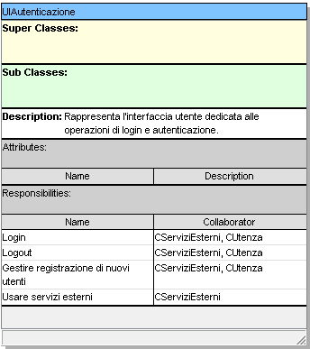

### 1.2 `UIRicerca`
**TipoClasse**: Boundary

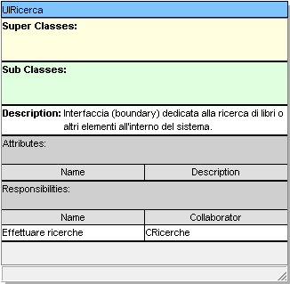

### 1.3 `UIUtente`
**TipoClasse**: Boundary

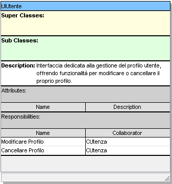

### 1.4 `UIGamification`
**TipoClasse**: Boundary

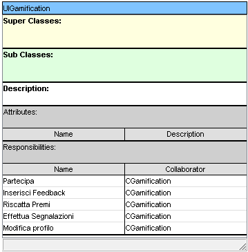

### 1.5 `UIAmministrativa`
**TipoClasse**: Boundary

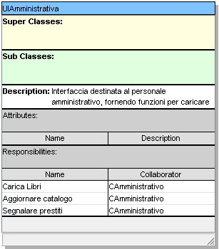

### 1.6 `UIBiblioteca`
**TipoClasse**: Boundary

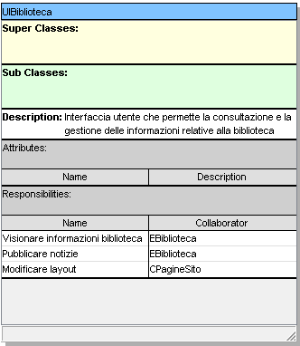

### 1.7 `UITesseramento`
**TipoClasse**: Boundary

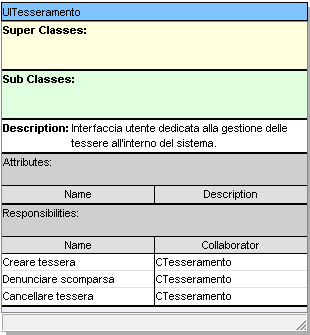

### 1.8 `UIPrestiti`
**TipoClasse**: Boundary

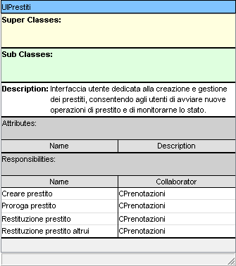

### 1.9 `UIPrestitiOnline`
**TipoClasse**: Boundary

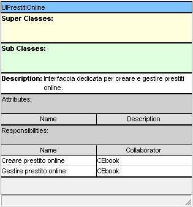

## 2. Control

### 2.1 `CAmministrativo`
**TipoClasse**: Control

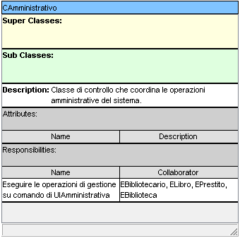

### 2.2 `CServiziEsterni`
**TipoClasse**: Control

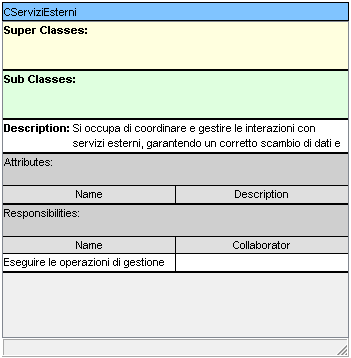

### 2.3 `CUtenza`
**TipoClasse**: Control

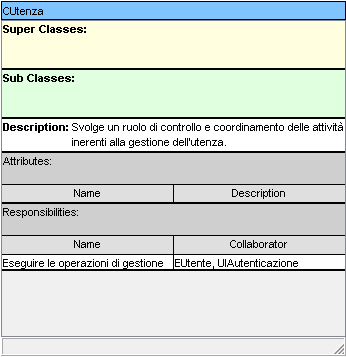

### 2.4 `CPrenotazioni`
**TipoClasse**: Control

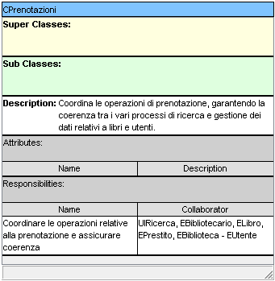

### 2.4 `CPrestiti`
**TipoClasse**: Control

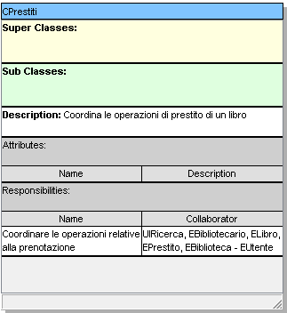

### 2.5 `CGamification`
**TipoClasse**: Control

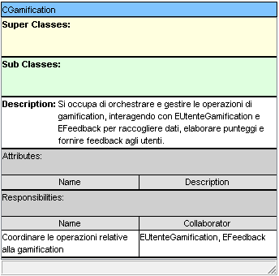

### 2.6 `CRicerche`
**TipoClasse**: Control

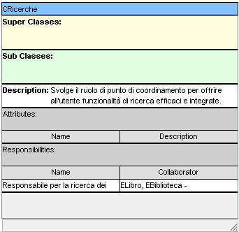

### 2.7 `CTesseramento`
**TipoClasse**: Control

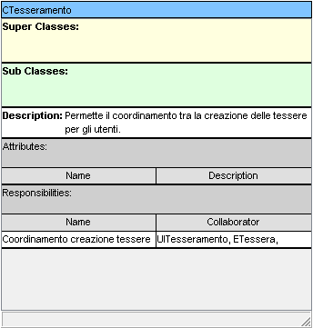

### 2.8 `CEbook`
**TipoClasse**: Control

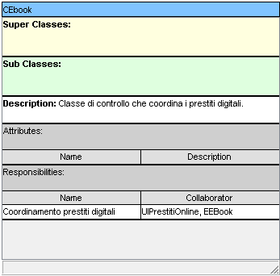

### 2.9 `CPagineSito`
**TipoClasse**: Control

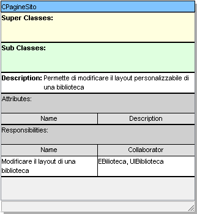

## 3. Entity

### 3.1 `EUtente`
**TipoClasse**: Entity

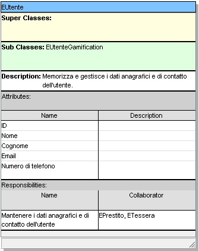

### 3.2 `EUtenteGamification`
**TipoClasse**: Entity

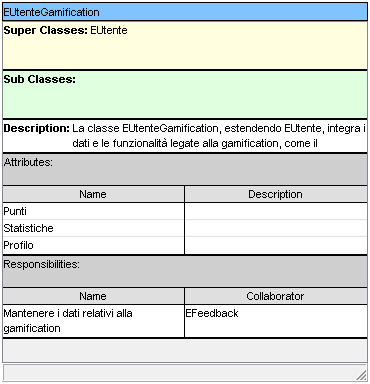

### 3.3 `EBibliotecario`
**TipoClasse**: Entity

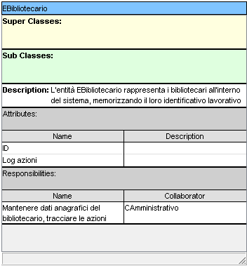

### 3.4 `ELibro`
**TipoClasse**: Entity

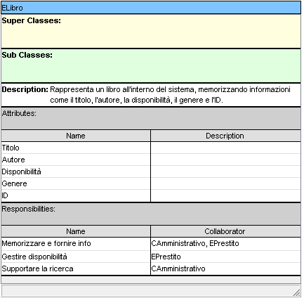

### 3.4 `EEBook`
**TipoClasse**: Entity

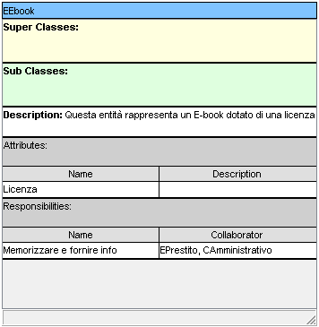

### 3.5 `EPrestito`
**TipoClasse**: Entity

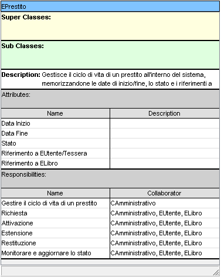

### 3.6 `ETessera`
**TipoClasse**: Entity

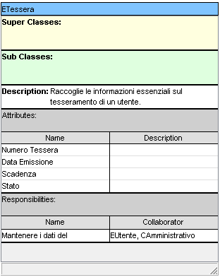

### 3.7 `EPrenotazione`
**TipoClasse**: Entity

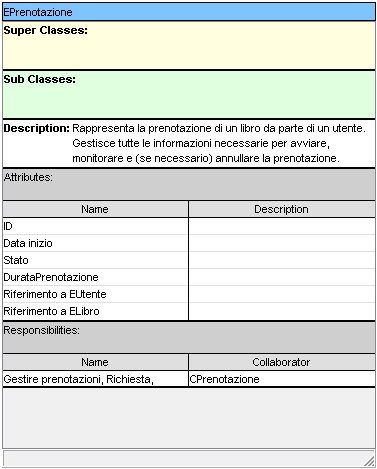

### 3.8 `EFeedback`
**TipoClasse**: Entity

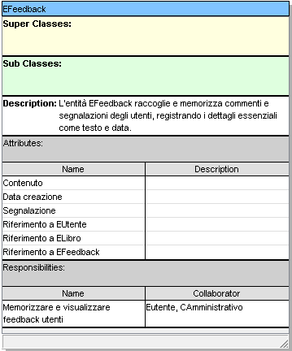

### 3.9 `EBiblioteca`
**TipoClasse**: Entity

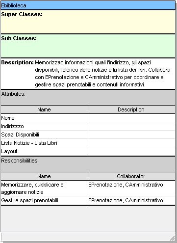