# Documento di Design – Gestione Biblioteche Romane

## 1. Introduzione
Il presente documento descrive in dettaglio l’implementazione del sistema per la gestione delle biblioteche romane, illustrando l'architettura scelta, i moduli, le interfacce e le modalità di comunicazione. Inoltre, vengono revisionati i diagrammi di sequenza prodotti durante l’analisi, costituendo così un riferimento fondamentale per le fasi di implementazione e validazione.

## 2. Obiettivi del Documento
- Fornire una panoramica dell'architettura del sistema.
- Descrivere in dettaglio i moduli e le componenti del sistema.
- Definire le interfacce e le modalità di comunicazione tra le componenti.
- Esplicitare le scelte progettuali e i pattern di design adottati.
- Costituire un riferimento per le fasi di implementazione e validazione.

## 3. Architettura del Sistema
Il sistema è strutturato secondo un'architettura a strati che separa le responsabilità in tre livelli principali:

- **Presentazione (Front-End):** Interfaccia utente web responsive per la gestione delle operazioni (ricerca libri, autenticazione, prenotazioni, ecc.).
- **Business Logic (Back-End):** Moduli responsabili della gestione delle regole di business, organizzati per ambiti funzionali (autenticazione, prestito, gamification, ecc.).
- **Persistenza:** Gestione e conservazione dei dati (utenti, libri, prestiti, tessere, prenotazioni, ecc.) tramite un database relazionale.

La comunicazione tra i livelli avviene attraverso API RESTful, mentre l’integrazione con servizi esterni (es. SPID, CIE) è gestita tramite interfacce dedicate e webhook sicuri.

(./img/diagramma_di_integrazio

## 4. Design delle Componenti
Il sistema è suddiviso in moduli che rispecchiano i casi d’uso e le funzionalità individuate durante l'analisi.

### 4.1 Modulo Autenticazione
**Funzioni:**  
- Gestione del login tramite sistemi interni ed esterni (AU_1, AU_2).  
- Registrazione e modifica della password (AU_3, AU_4).  
- Logout (AU_5).

**Design:**  
- Utilizzo di form sicuri e validazione lato client e server.
- Integrazione con sistemi di autenticazione esterni mediante protocolli standard.

### 4.2 Modulo Tesseramento
**Funzioni:**  
- Gestione delle operazioni di nuovo tesseramento, rinnovo, cancellazione, denuncia di smarrimento e furto (T_1, T_2, T_3, T_4, T_5).

**Design:**  
- Utilizzo di form di richiesta con rigorosa validazione dei dati.
- Interazione con il modulo amministrativo per l'approvazione e l'aggiornamento dello stato della tessera.

### 4.3 Modulo Gamification
**Funzioni:**  
- Partecipazione al sistema di gamification, gestione del profilo, inserimento e segnalazione di commenti/recensioni, riscossione dei punti (G_1, G_2, G_3, G_4, G_5).

**Design:**  
- Interfaccia dedicata per la visualizzazione dei punteggi e la scelta dei premi.
- Meccanismi di moderazione e segnalazione per garantire la qualità dei contenuti.

### 4.4 Modulo Prestito Libri
**Funzioni:**  
- Ricerca e richiesta di prestito per libri fisici ed e-book (PL_1, PL_4).  
- Restituzione e richiesta di allungamento del prestito (PL_2, PL_3).

**Design:**  
- Catalogo dinamico con paginazione per gestire grandi volumi di dati.
- Sistema di notifiche (via email o alert) per ricordare la restituzione o l'allungamento del prestito.

### 4.5 Modulo Prenotazione Spazi
**Funzioni:**  
- Gestione della prenotazione e cancellazione degli spazi comuni (PS_1, PS_2).  
- Segnalazione di comportamenti errati nelle prenotazioni (PS_3).

**Design:**  
- Visualizzazione in tempo reale della disponibilità degli spazi.
- Sistema di conferma e notifica delle prenotazioni tramite email.

### 4.6 Modulo Sezione Amministrativa
**Funzioni:**  
- Caricamento di nuovi libri, segnalazione dei prestiti e pubblicazione di notizie (SA_1, SA_2, SA_3, SA_4).

**Design:**  
- Dashboard amministrativa ad accesso riservato.
- Funzionalità di editing e aggiornamento centralizzato dei contenuti.

## 5. Interfacce e Comunicazione
- **API RESTful:**  
  Le componenti del sistema comunicano tramite API RESTful, con endpoint dedicati per le operazioni CRUD e la gestione dei flussi di lavoro.
  
- **Interfacce Utente:**  
  Il front-end fornisce un’interfaccia intuitiva e responsive, sviluppata con framework moderni, che interagisce con il back-end tramite chiamate API.
  
- **Integrazione Esterna:**  
  Le comunicazioni con i servizi esterni (es. SPID, CIE) sono gestite attraverso client specifici e middleware, garantendo la sicurezza e l’affidabilità dei webhook.

## 6. Design delle Classi e Pattern
Il design orientato agli oggetti è supportato dalle schede CRC sviluppate in fase di analisi. Le classi principali e i loro metodi sono definiti seguendo il principio "nomi-verbi" per garantire chiarezza e coerenza. Tra i pattern adottati figurano:

- **MVC (Model-View-Controller):** Separazione della logica di presentazione dalla business logic.
- **Repository Pattern:** Astrazione della persistenza e gestione delle operazioni CRUD.
- **Dependency Injection:** Gestione delle dipendenze tra le componenti e semplificazione del testing.
- **Singleton:** Gestione di risorse condivise (es. connessione al database o client per servizi esterni).

## 7. Scelte Tecnologiche

- **Front-End:**  
  - Linguaggio: JavaScript/TypeScript  
  - Framework: Vue.js  
  - Librerie: Bootstrap (per l'interfaccia utente)

- **Back-End:**  
  - Linguaggio: Go  
  - Comunicazione tramite API RESTful tra front-end e back-end

- **Persistenza:**  
  - Database relazionale (PostgreSQL)

- **Sicurezza:**  
  - Autenticazione e autorizzazione basate su token (JWT) per la gestione degli utenti  
  - Autenticazione basata su certificati per la gestione dei bibliotecari

## 8. Considerazioni sul Deployment e Scalabilità

- **Deployment:**  
  - Il sistema sarà distribuito in un ambiente cloud per garantire scalabilità e alta disponibilità.
  - Utilizzo di container (Docker) per il packaging e il deployment delle componenti.

- **Scalabilità:**  
  - L'architettura a micro-servizi consente di scalare ogni componente in base al carico.
  - Implementazione di load balancer e sistemi di caching per ottimizzare le performance.

## 9. Diagrammi di classe 

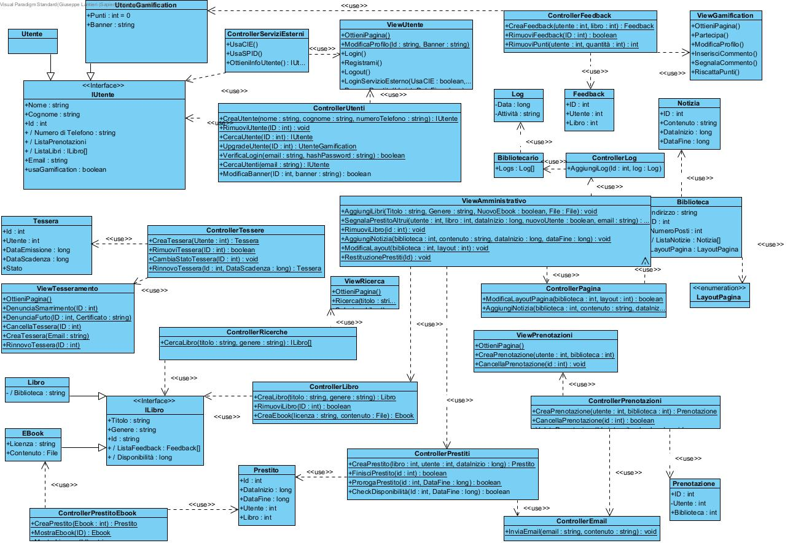

## 10. Diagrammi di stato

**Stato di una entità Libro**  
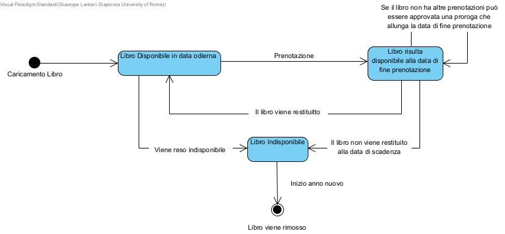

**Stato di una entità Tessera**  
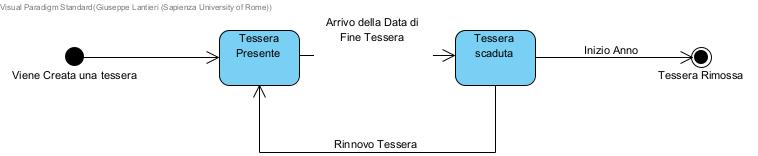

**Stato di una entità Utente**  
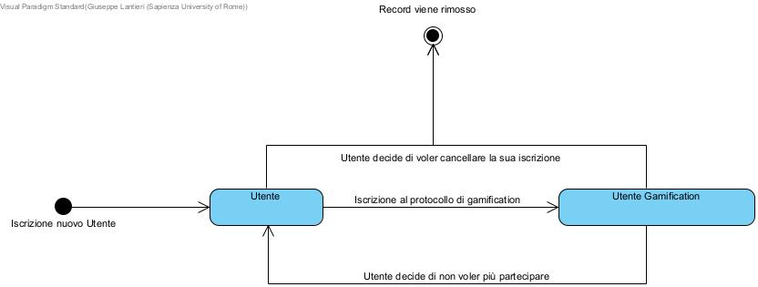

## 11. Diagrammi di sequenza 

Per brevita riportiamo i diagrammi classe più interessanti

**AU_1**: Autenticazione Utente Sistema Interno  
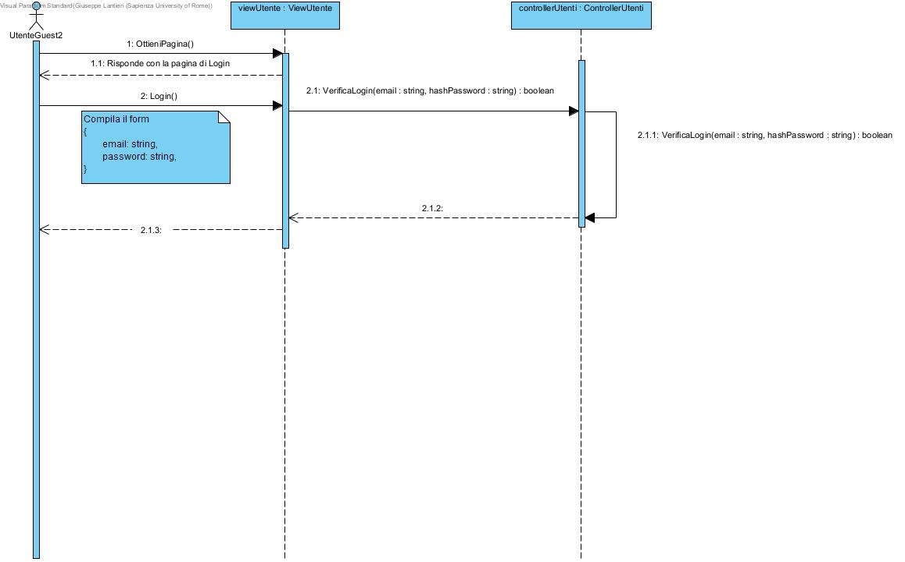

**AU_2**: Autenticazione Utente Tramite Sistema Esterno  
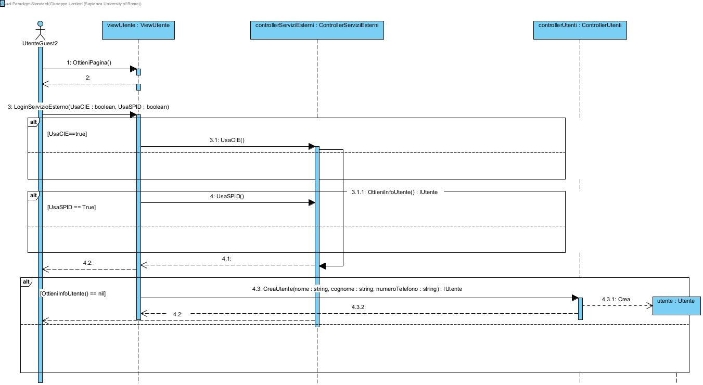

**G_1**: Partecipazione al Sistema di Gamification  
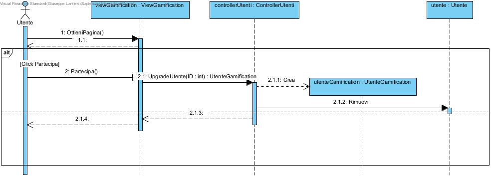

**PL_1**: Ricerca Libro Fisico e Richiesta di Prestito  
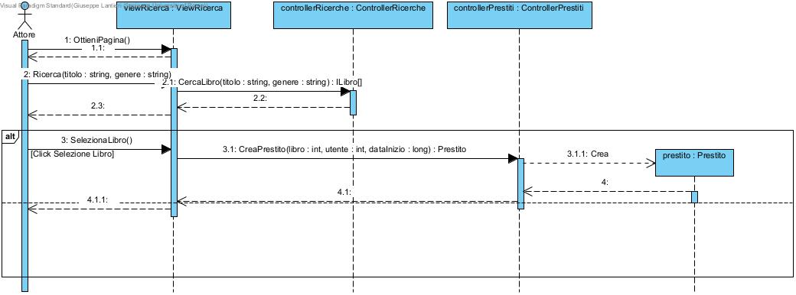

**PL_2**: Restituzione Prestito Fisico  
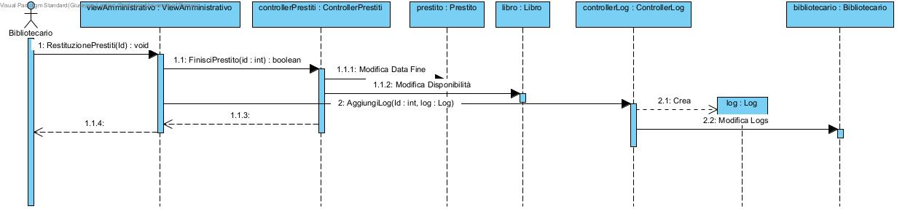

**PL_3**: Richiesta Allungamento Prestito Fisico  
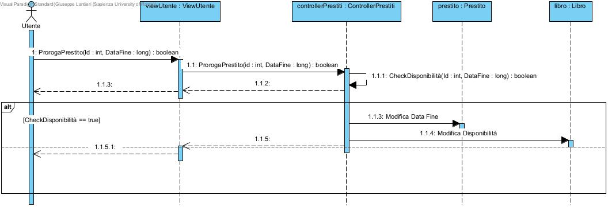

**PL_4**: Richiesta E-book
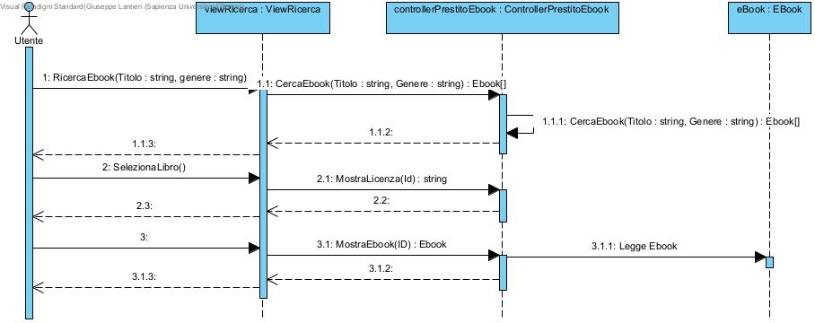

**PS_1**: Prenotazione di uno Spazio Comune  
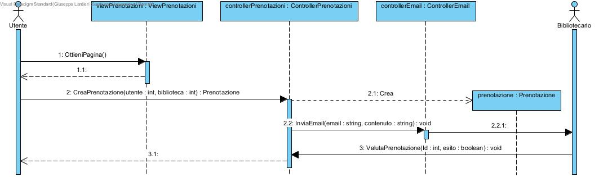

**PS_2**: Cancellazione di una Prenotazione  
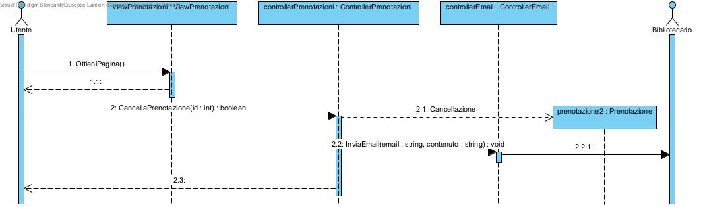

**SA_1**: Caricamento Nuovi Libri  

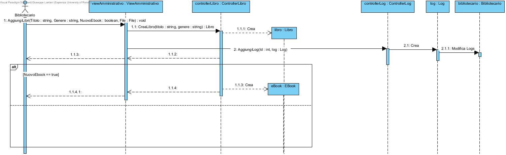

**SA_2**: Segnalazione Prestito Avvenuto Dal Vivo  
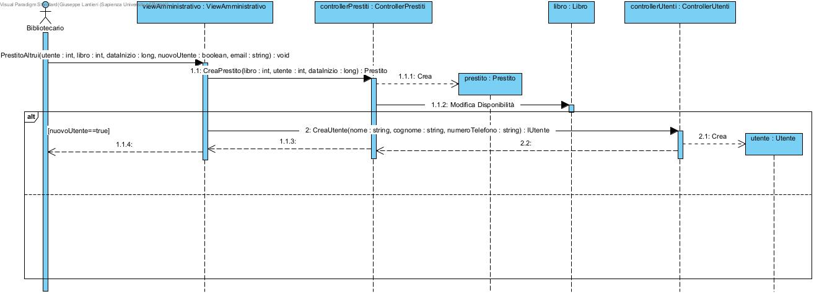

**SA_3**: Segnalazione Notizie  
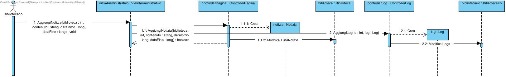

## 12. Diagramma Entita Relazione

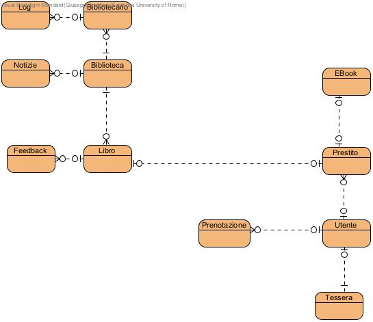

## 13. Diagramma di Design delle componenti

Come descritto in precedenza le componenti del sistema si basano su un frontend sviluppato in vue.js che comunica con il backend sviluppato in GO tramite API RESTful, con endpoint dedicati per le operazioni CRUD e la gestione dei flussi di lavoro verso le istanze dei Database dedicati alle gestione delle varie entità (Utenti,Prestito,Tesseramento,Gamification,PrenotazioneSpazi,SezioneAmministrativa).

Di seguito viene riportato il modello delle interazioni tra le componenti architetturali all'esecuzione dei metodi descritti nei diagrammi di sequenza.

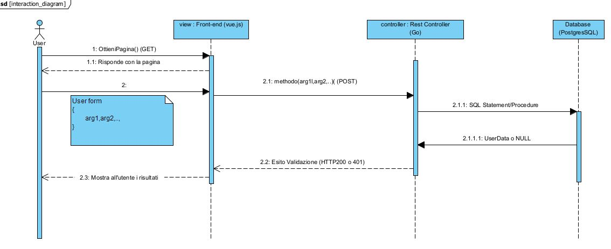
